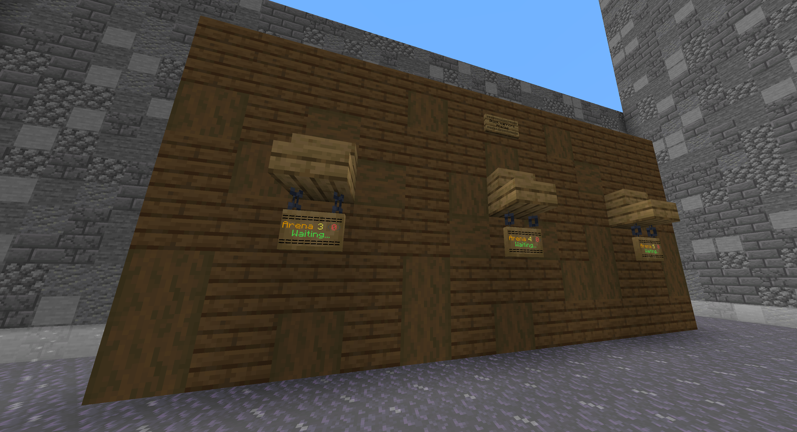
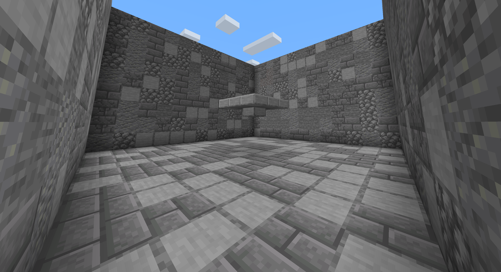
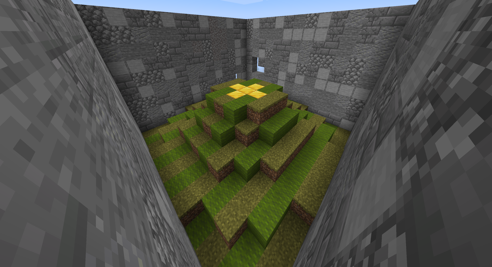
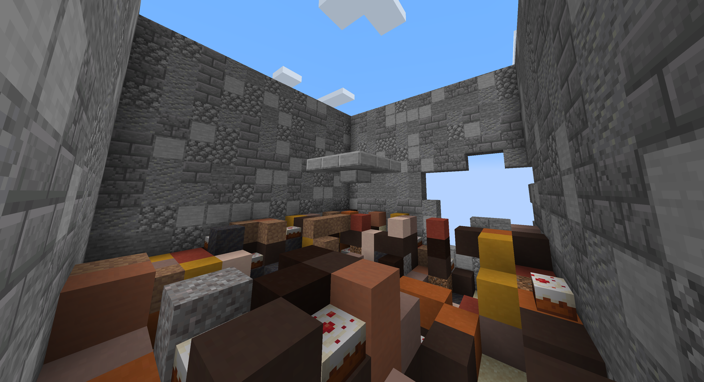
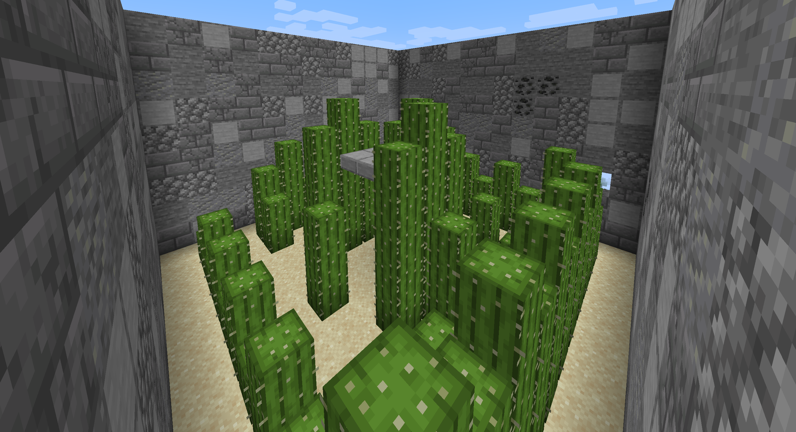

# Block Warriors World

> The lobby and mini-game maps for the '[Block Warriors](https://github.com/EsotericEnderman/block-warriors)' Minecraft plugin.

## Gallery

### Game Arenas

## License

  &copy; 2024-2025 <a rel="cc:attributionURL dct:creator" property="cc:attributionName" href="https://github.com/esotericenderman">Esoteric Enderman</a>

  <a property="dct:title" rel="cc:attributionURL" href="https://github.com/esotericenderman/block-warriors-world">Block Warriors World</a> is licensed under <a href="https://github.com/esotericenderman/block-warriors-world/blob/main/LICENSE" target="_blank" rel="license noopener noreferrer" property="cc:license" style="display: inline-block">CC BY-SA 4.0</a>.

  

## Topics

[minecraft](https://github.com/topics/minecraft), [world](https://github.com/topics/world), [minecraft-map](https://github.com/topics/minecraft-map), [minecraft-map-making](https://github.com/topics/minecraft-map-making), [minecraft-world](https://github.com/topics/minecraft-world), [minecraft-worlds](https://github.com/topics/minecraft-worlds), [minecraft-maps](https://github.com/topics/minecraft-maps), [minecraft-world-export](https://github.com/topics/minecraft-world-export)
